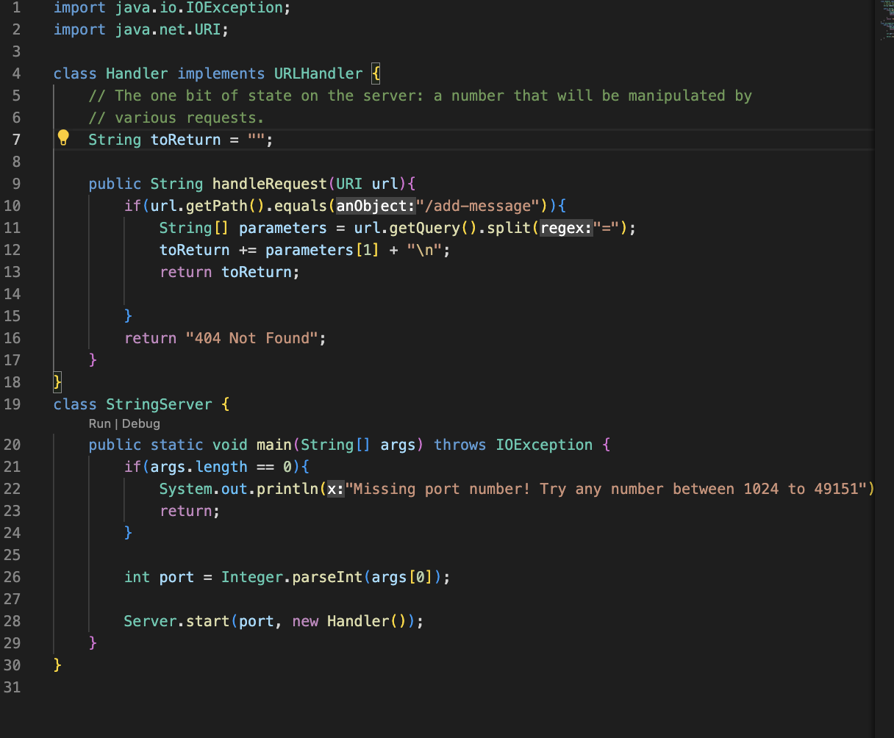
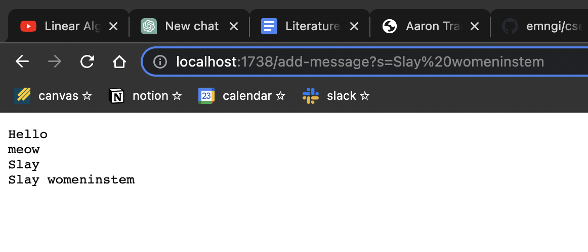
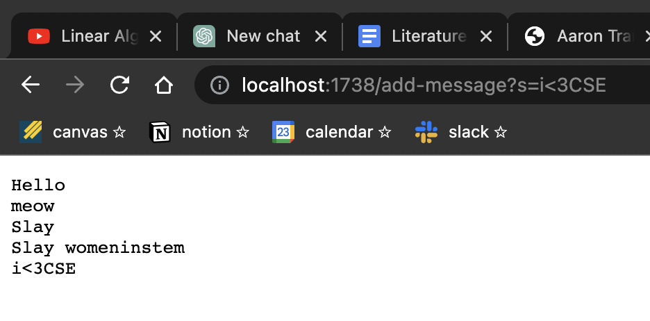
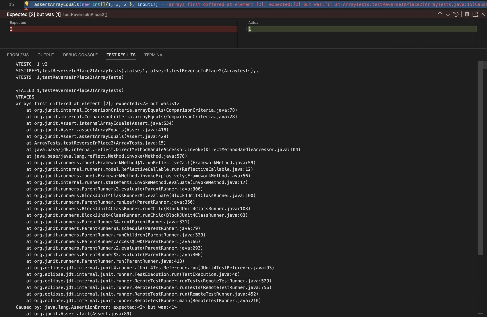
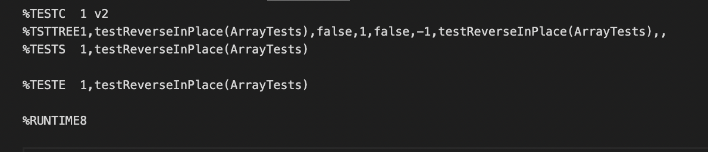

## Part 1: String Server
*I used the code from Lab 2 as a model for this code*

---

- The handleRequest method was called here as a server had already been created and I had already added some messages.
- The relevant arguments were "Slay womeninstem", the field `toReturn` is now `"Hello \n meow \n slay \n Slay womeninstem \n"`
- The value changed after this request because the method adds the request to the `toReturn` value


- The handleRequest method was called here again
- The relevant arguments were "I<3CSE", the field `toReturn` is now `"Hello \n meow \n slay \n Slay womeninstem \n I<3CSE \n"`
- The value changed after this request because the method adds the request to the `toReturn` value

## Part 2: Bugs
An example of failure inducing code for the reverseInPlace method:
```java
@Test 
public void testReverseInPlace2() {
   int[] input1 = {2, 3 ,1};
   ArrayExamples.reverseInPlace(input1);
   assertArrayEquals(new int[]{1, 3, 2 }, input1);
}
```
Output: 

*symptom is that 2 was expected but instead the test saw 1*

An example of non-failure inducing input for the reverseInPlace method:
```java
@Test 
	public void testReverseInPlace() {
    int[] input1 = { 0,1,0 };
    ArrayExamples.reverseInPlace(input1);
    assertArrayEquals(new int[]{ 0,1,0 }, input1);
	}
  ```
Output: 


---
##### reverseInPlace code before:
```java
static void reverseInPlace(int[] arr) {
  for(int i = 0; i < arr.length; i += 1) {
     arr[i] = arr[arr.length - i - 1];
  }
}
  ```
  ##### reverseInPlace code after:
```java
static void reverseInPlace(int[] arr) {
  for(int i = 0; i < arr.length/2; i += 1) {
     int temp = arr[i];
     arr[i] = arr[arr.length - i - 1];
     arr[arr.length - i - 1] = temp;
  }
}
```
These changes fixed the code because since the method was supposed to alter the array, not create a new one, we needed to add a temp var to store the first half of the elements as they were swapped with the second half of the elements. Then assign what was stored in temp to the index of the second half of the current array.

## Part 3
In week two I learned how to run servers. I found this especially interesting in the part where we could acess other groups servers they had created and it would work on our personal laptops. This was the first time I could see how code runs on other people's devices remotely. I also learned a good amount of debugging strategies from lab 3. Learning that even though a test may pass, there still may be bugs.
