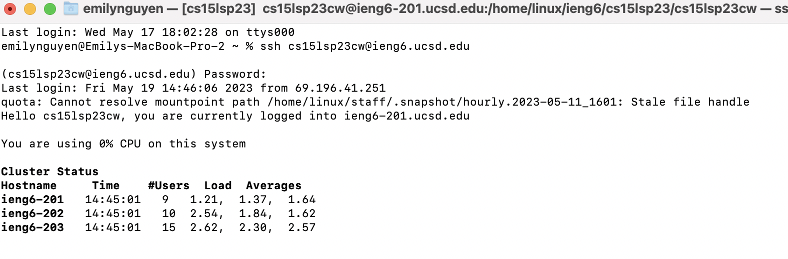
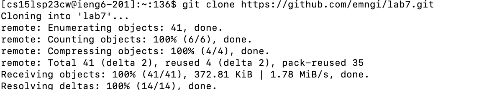

# Lab Report 4
---

## 1. Log into ieng6

   * I used `Ctrl + C` and `Ctrl + V` to copy credentials from notes
  ``` java
  $ ssh cs15lsp23cw@ieng6.ucsd.edu <Enter>
  (cs15lsp23cw@ieng6.ucsd.edu) Password: <Paste or type password and hit Enter>
  ```
  
  
---
  
## 2. Clone your fork of the repository from your Github account
   * I used `Ctrl + C` and `Ctrl + V` to copy this command from the lab write up
``` java
$ git clone https://github.com/emngi/lab7.git <Enter>
```

---
## 3. Run the tests, demonstrating that they fail
   * I used tab to autocomplete t into `test.sh` 
```java
$ cd lab7 <Enter>
$ bash t<Tab> <Enter>
```

--- 
## 4. Edit the code file to fix the failing test
   * I use <tab> twice to autofill L to `ListExamples.java`
```java
$ vim L<tab>.j<tab> <Enter>
$ /index1 <Enter> n n n n n n n n n l l l l l r 2 <Esc> :wq
```

  
--- 
  
## 5. Run the tests, demonstrating that they now succeed
`$ bash t<tab>`
  

  
---
  
## 6. Commit and push the resulting change to your Github account (you can pick any commit message!)
     * I use <tab> twice to autofill L to `ListExamples.java`
  ```java
  $ git add L<Tab>.j<Tab> <Enter>
  $ git commit -m Done! <Enter>
  $ git push origin
 ```
  
  
